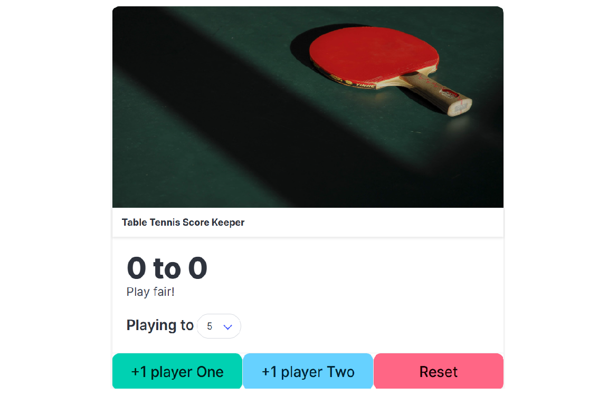

# ttScoreKeeper

Welcome to **ttScoreKeeper**! 🏓

Keep track of your table tennis matches with ease and style. This playful scorekeeper lets you focus on the fun, not the math!

*Styled with the awesome [Bulma](https://bulma.io/) CSS framework!*

## How it works

- Click the buttons to add points for each player.
- Choose the winning score before you start.
- Hit reset to start a new game anytime.

## Contact

Have feedback, ideas, or just want to say hi? Drop a message at **asf1k.til@gmail.com**. I'd love to hear from you!
